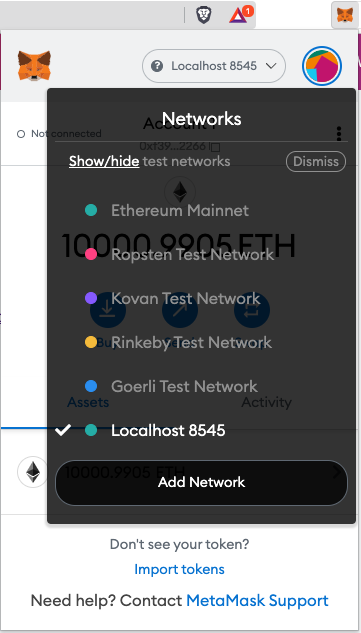

# Conference

Simple Conference application where an *conference owner* can create a conference. Features are:

1. Set ticket *price* of conference in ether. Could be (DAI)[], (USDC)[] or any other token. E.g an ERC20 token
2. Set _reward factor_ which is used to decide how much *speakers* will recieve as reward.
3. Auth actors before they can be *attendees* or *speakers* 
  * This is done like this here, but we don't want the *conference owner* to pre-auth the actors. Should be done otherwise e.g. third-party authorization which then call the `auth` function
4. Delegate _auth_ priviligess to *auth provider*  
5. Give tickets to *attendees*
6. Close registration which enables reward claims for *conference owner* and *speakers*
7. Claim reward as *conference owner*/*speaker*

This repo is created to illustrate role logic in smart contracts and demonstrate development and testing of smart contract and how to interact with them from js/ts.

3. Get started

1. Clone the repo and cd into it `git clone https://github.com/symfoni/conference MyConference && cd MyConference`
2. Install deps with yarn `yarn` or npm `npm install`
3. Run tests by `npx hardhat test`
3. Start hardhat `npx hardhat node --watch`


```text
It runs up a Hardhat node, compile contracts, generates typescript interfaces, creates React context and instantiates your contract instances and factories with frontend provider.
```

4. Open up a new terminal
5. Enter the frontend directory: `cd frontend`
6. Install dependencies: `npm install`
7. Open your browser and install Metamask. *IMPORTANT! Do this in a seperate profile in your browser to prevent using your real Metamask wallet*
8. Open Metamask extension
9. Click `Get started`
10. Click `Import wallet` by the  `No, I already have a Secret Recovery Phrase` option. Click `I agree`.
11. In the "Secret Recovery Phrase, use `test test test test test test test test test test test junk`. This is the same phrase used for deployment of the smart contract on your local hardhat node network.
12. Set a password(not important to be secure because this is just for testing on a test network)
13. Click "All done"
14. You will now see your Metamask account
15. Click on the circular "account picture" in top right corner.
16. Click on "Settings"
17. Go to "Advanced"
18. Enable "Show test networks"
19. Close Settings
20. Change network in Metmask extension to local network at `http://localhost:8545`. This is the network you have running locally with `hardhat` from *Get Started*




21.  Ensure Metamask RPC is set to `http://localhost:8545` and chainID `31337`.
12. Start the React app: `npm start`

The frontend should open at http://localhost:3000/

Because of this default hardhat.config.ts it will first try to connect with an injected provider like Metamask (web3modal package does this).

If nothing found it will try to connect with your hardhat node. On localhost and hardhat nodes it will inject your mnemonic into the frontend so you have a "browser wallet" that can both call and send transactions. NB! Dont ever put a mnemonic with actual value here.

In hardhat.config.ts there is example on how to instruct your hardhat-network to use mnemonic or privatekey.

```ts
const config: HardhatUserConfig = {
  react: {
    providerPriority: ["web3modal", "hardhat"],
  },
};
```

Ensure you are useing RPC to http://localhost:8545.

You may also need to set the chainID to 31337 if you are useing Hardhat blockchain development node.

## Invalid nonce.

```bash
eth_sendRawTransaction
  Invalid nonce. Expected X but got X.
```

Reset your account in Metamask.

# We ❤️ these **Ethereum** projects:

- [Hardhat 👷](https://hardhat.org/)
- [Hardhat-deploy 🤘](https://hardhat.org/plugins/hardhat-deploy.html)
- [Typechain 🔌](https://github.com/ethereum-ts/Typechain#readme)
- [hardhat-typechain 🧙‍♀️](https://hardhat.org/plugins/hardhat-typechain.html)
- [ethers.js v5 ⺦](https://github.com/ethers-io/ethers.js#readme)
- [web3modal 💸](https://github.com/Web3Modal/web3modal#web3modal)
- [ts-morph 🏊‍♂️](https://github.com/dsherret/ts-morph)
- [@symfoni/hardhat-react 🎻(our own)](https://www.npmjs.com/package/@symfoni/hardhat-react)
